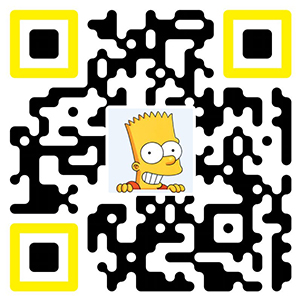

# SpokesSimpsons

This is a meme generator that can generate Stickers of the Simpsons via Wechat Screenshots or directly according to your given text.

> Google ML Winter Camp (Beijing) 2020，Team members: Fang Liu, Zeyu Yang, Zhengqi Yong

## Getting Started

### Requirement

Install ` OpenNMT-py ` from ` pip ` :

``` pip install OpenNMT-py ```

- Python 3.6
- Pytorch 1.2
- Tensorflow >= 2.0
- Flask >= 1.1
- Flutter >= 1.12

### Running

1. For development, run `python app.py`. Gunicorn or uWSGI is recommanded for production.
2. Config Nginx to forward requests.
3. CertBot is recommended for SSL.

## Contributing

Please read [Poster.pdf](https://github.com/yongzhengqi/spokessimpsons/blob/master/Poster.pdf) for details on our code of conduct, and the process for submitting pull requests to us.

## License

This project is licensed under the MIT License

## Reference

* <https://github.com/omar178/Emotion-recognition>

* Klein, Guillaume , et al. "OpenNMT: Open-Source Toolkit for Neural Machine Translation." (2017).

* Reimers, Nils, and Iryna Gurevych. "Sentence-BERT: Sentence Embeddings using Siamese BERT-Networks." *(EMNLP-IJCNLP)*. 2019.

* Tian, Zhi, et al. "Detecting text in natural image with connectionist text proposal network." European conference on computer vision. Springer, Cham, 2016.

* [https://github.com/sirfz/tesserocr](https://github.com/sirfz/tesserocr)

## Demo



